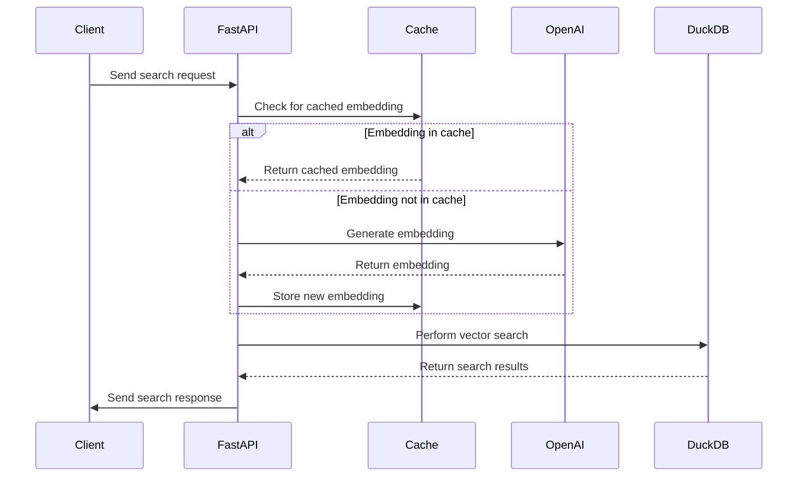

# DVS - DuckDB Vector Similarity Search API

A high-performance vector similarity search API powered by DuckDB and OpenAI embeddings.

## Overview

DVS (DuckDB-VSS-API) is a FastAPI-based web service that provides efficient vector similarity search capabilities using DuckDB as the backend database and OpenAI's embedding models for vector representation. This project is designed for applications requiring fast similarity search capabilities, such as recommendation systems, semantic search engines, and content discovery platforms.

## Key Features

- Single and bulk vector similarity searches
- Caching of embeddings for improved performance
- Support for both text queries and pre-computed vector embeddings
- Configurable search parameters (e.g., top-k results, embedding inclusion)
- Integration with OpenAI's latest embedding models

## Architecture



## Installation

1. Clone the repository:
   ```shell
   git clone https://github.com/allen2c/dvs.git
   cd dvs
   ```

2. Install dependencies using Poetry:
   ```shell
   poetry install -E all --with dev
   ```

3. Set up environment variables:
   Create a `.env` file in the project root and add the following:
   ```shell
   OPENAI_API_KEY=your_openai_api_key_here
   ```

4. Download the initial database (if required):
   ```shell
   export DOWNLOAD_DB_URL='your_database_download_url'
   ./download_db.sh
   ```

   Or use git lfs to download the demo database:
   ```shell
   git lfs pull --include="examples/documents.duckdb" && cp examples/documents.duckdb ./data/documents.duckdb
   ```

   Or build example datasets from scratch:
   ```shell
   make build-example-datasets
   ```

## Usage

1. Start the FastAPI server:
   ```shell
   make run-server-dev
   ```

2. Access the API documentation:
   Open your browser and navigate to `http://localhost:8000/docs` for the Swagger UI.

3. Make API requests:
   - Single search: `POST /search` or `POST /s`
   - Bulk search: `POST /bulk_search` or `POST /bs`

## Development

- Format code:
  ```shell
  make format-all
  ```

- Run tests:
  ```shell
  make pytest
  ```

- Update dependencies:
  ```shell
  make update-all
  ```

## Configuration

The API behavior can be configured using environment variables. See the `Settings` class in `duckdb_vss_api.py` for available options.

## License

This project is licensed under the MIT License. See the [LICENSE](LICENSE) file for details.

## Contributing

Contributions are welcome! Please feel free to submit a Pull Request.
