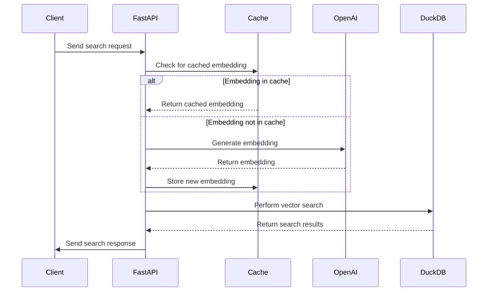

# DVS - DuckDB Vector Similarity Search API

A high-performance vector similarity search API powered by DuckDB and OpenAI embeddings.

## Overview

DVS (DuckDB-VSS-API) is a FastAPI-based web service that provides efficient vector similarity search capabilities using DuckDB as the backend database and OpenAI's embedding models for vector representation. This project is designed for applications requiring fast similarity search capabilities, such as recommendation systems, semantic search engines, and content discovery platforms.

## Key Features

- Single and bulk vector similarity searches
- Caching of embeddings for improved performance
- Support for both text queries and pre-computed vector embeddings
- Configurable search parameters (e.g., top-k results, embedding inclusion)
- Integration with OpenAI's latest embedding models

## Architecture



## Installation

1. Install from PyPI:
   ```shell
   pip install dvs-py
   ```

## Usage

### Build database from scratch

```python
import asyncio
import tempfile

from rich import print

from dvs import DVS
from dvs.types.document import Document

dvs = DVS(tempfile.NamedTemporaryFile(suffix=".duckdb").name)

# Add document to the database
dvs.add(
    """
    Apple has announced new features for its upcoming iPhone, including an upgraded camera system and a new A16 chip for faster processing. The introduction of "Focus Mode" will allow users to customize notifications based on their activities.
    """.strip()  # noqa: E501
)
# Bulk add documents to the database
dvs.add(
    [
        Document.from_content(
            name="Microsoft Expands Cloud Services with Azure Updates",
            content="Microsoft has updated its Azure cloud services with enhanced AI and machine learning tools, along with new security features for data protection. These improvements aim to help businesses innovate and scale their operations more effectively.",  # noqa: E501
        ),
        Document.from_content(
            name="Google Introduces New AI Tools for Workspace",
            content="Google has launched new AI tools for Workspace, including smart compose in Docs and advanced data analysis in Sheets. These features are designed to streamline workflows and enhance productivity for users.",  # noqa: E501
        ),
    ]
)
print(f"DuckDB database path: {dvs.db_path.resolve()}")

# Query the database
results = asyncio.run(dvs.search("What are the new features of the iPhone?"))
print(results)
# [
#     (
#         Point(
#             point_id="pt-8803e5df-c9df-4b01-9ce4-0b96217bf1f6",
#             document_id="doc-b87f979a-b994-42c3-aa7f-70b76ff97da4",
#             content_md5="14c88c0886f1ed68629303cf11270885",
#             embedding=[],
#             metadata={},
#         ),
#         Document(
#             document_id="doc-b87f979a-b994-42c3-aa7f-70b76ff97da4",
#             name="Apple has announced new feat",
#             content="Apple has announced new features for its upcoming iPhone ...",
#             content_md5="14c88c0886f1ed68629303cf11270885",
#             metadata={"content_length": 239},
#             created_at=1733470507,
#             updated_at=1733470507,
#         ),
#         0.6913947463035583,
#     ),
#     (
#         Point(
#             point_id="pt-310b0550-b6c0-49fd-897f-fbc59f28e1f3",
#             document_id="doc-958469dd-e1c9-4ead-8620-b730ce51220b",
#             content_md5="79d8a6366ec174987672ec850af072d8",
#             embedding=[],
#             metadata={},
#         ),
#         Document(
#             document_id="doc-958469dd-e1c9-4ead-8620-b730ce51220b",
#             name="Microsoft Expands Cloud Services with Azure Updates",
#             content="Microsoft has updated its Azure cloud services ...",
#             content_md5="79d8a6366ec174987672ec850af072d8",
#             metadata={},
#             created_at=None,
#             updated_at=None,
#         ),
#         0.27888885140419006,
#     ),
#     (
#         Point(
#             point_id="pt-b4f5f590-2040-44e1-b79f-26ee05f8a9cc",
#             document_id="doc-2f43a241-e9e0-46b6-8df2-cc1898a13f14",
#             content_md5="3a9a118392776e9dbcb4f6feb43dbaf0",
#             embedding=[],
#             metadata={},
#         ),
#         Document(
#             document_id="doc-2f43a241-e9e0-46b6-8df2-cc1898a13f14",
#             name="Google Introduces New AI Tools for Workspace",
#             content="Google has launched new AI ...",
#             content_md5="3a9a118392776e9dbcb4f6feb43dbaf0",
#             metadata={},
#             created_at=None,
#             updated_at=None,
#         ),
#         0.22798193991184235,
#     ),
# ]
```

### Usage in API Server

1. Start the FastAPI server:
   ```shell
   DB_PATH=<path/to/duckdb> && make run-server-dev DB_PATH=$DB_PATH
   ```

2. Access the API documentation:
   Open your browser and navigate to `http://localhost:8000/docs` for the Swagger UI.

3. Make API requests:
   - Single search: `POST /search` or `POST /s`
   - Bulk search: `POST /bulk_search` or `POST /bs`

```python
import base64

import numpy as np
import openai
import requests
from rich import print

# Query text search
response = requests.post(
    "http://localhost:8000/search",
    json={"query": "AMD yes!", "top_k": 3},
)
print(response.json())
# {
#     'results': [
#         {
#             'point': {
#                 'point_id': 'pt-bac54213-f476-4fb0-9813-24492135ad85',
#                 'document_id': 'doc-18610658-cf88-4a53-b2ac-7e47e16465a5',
#                 'content_md5': '1fc96c3d1916da4075947eb136673c16',
#                 'embedding': [],
#                 'metadata': {}
#             },
#             'document': {
#                 'document_id': 'doc-18610658-cf88-4a53-b2ac-7e47e16465a5',
#                 'name': '348.txt',
#                 'content': 'Game makers get Xbox 2 sneak peek...',
#                 'content_md5': '1fc96c3d1916da4075947eb136673c16',
#                 'metadata': {'file': '348.txt', 'content_length': 2589},
#                 'created_at': 1733371367,
#                 'updated_at': 1733371367
#             },
#             'relevance_score': 0.31964972615242004
#         },
#         {
#             'point': {
#                 'point_id': 'pt-7bcba958-ce5b-4d0d-b9d4-7b4fe4ec77cd',
#                 'document_id': 'doc-de784541-a0fa-430b-9376-44bbbec8ccd4',
#                 'content_md5': '878e78314cc8e162642b3d9028c6e0d2',
#                 'embedding': [],
#                 'metadata': {}
#             },
#             'document': {
#                 'document_id': 'doc-de784541-a0fa-430b-9376-44bbbec8ccd4',
#                 'name': '329.txt',
#                 'content': 'Intel unveils laser breakthrough...',
#                 'content_md5': '878e78314cc8e162642b3d9028c6e0d2',
#                 'metadata': {'file': '329.txt', 'content_length': 2883},
#                 'created_at': 1733371367,
#                 'updated_at': 1733371367
#             },
#             'relevance_score': 0.3183119297027588
#         },
#         {
#             'point': {
#                 'point_id': 'pt-a0032c53-362a-4caf-8db7-ed1559450e8f',
#                 'document_id': 'doc-cc036752-b5e7-4729-85c7-dc09a3f18d34',
#                 'content_md5': '5bf7dc32f230d0f427faec2ae3aa5b48',
#                 'embedding': [],
#                 'metadata': {}
#             },
#             'document': {
#                 'document_id': 'doc-cc036752-b5e7-4729-85c7-dc09a3f18d34',
#                 'name': '019.txt',
#                 'content': 'Intel unveils laser breakthrough...',
#                 'content_md5': '5bf7dc32f230d0f427faec2ae3aa5b48',
#                 'metadata': {'file': '019.txt', 'content_length': 2875},
#                 'created_at': 1733371367,
#                 'updated_at': 1733371367
#             },
#             'relevance_score': 0.31670358777046204
#         }
#     ]
# }


# Query array search
vector = (
    openai.OpenAI()
    .embeddings.create(
        input="Play Nintendo Switch", model="text-embedding-3-small", dimensions=512
    )
    .data[0]
    .embedding
)
response = requests.post(
    "http://localhost:8000/search",
    json={"query": vector},
)
print(response.json())


# Query array in base64
vector = (
    openai.OpenAI()
    .embeddings.create(
        input="IBM is a company", model="text-embedding-3-small", dimensions=512
    )
    .data[0]
    .embedding
)
vector_base64 = base64.b64encode(np.array(vector, dtype=np.float32).tobytes()).decode(
    "ascii"
)
response = requests.post(
    "http://localhost:8000/search",
    json={"query": vector_base64},
)
print(response.json())

# Bulk search
response = requests.post(
    "http://localhost:8000/bulk_search",
    json={"queries": [{"query": "PlayStation 2"}, {"query": "Xbox 360"}]},
)
print(response.json())
# {"results": [{"results": [...]}, {"results": [...]}]}
```

## License

This project is licensed under the MIT License. See the [LICENSE](LICENSE) file for details.

## Contributing

Contributions are welcome! Please feel free to submit a Pull Request.
