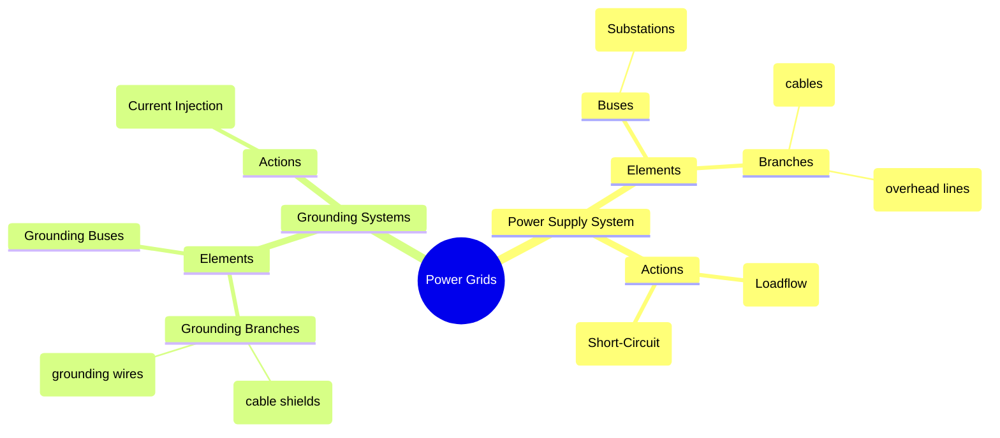
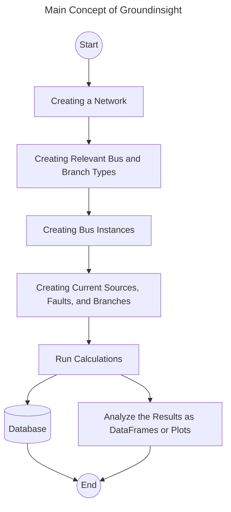

# Project Title 
**Groundinsight: Advanced Analytics in Grounding Systems**

# Project Description
Groundinsight is a Python package for analyzing the behavior of grounding systems during phase-to-ground faults. It allows you to create a network structure with buses, branches, and fault current sources. 

The main concept of the project is the creation of Pydantic models representing the physical grid elements and a calculation core using NumPy and SciPy solvers for linear equations. 

The SQLite interface enables saving and loading networks or element types from data storage using SQLAlchemy. Beyond storing to a database, the use of Pydantic models allows serialization of all elements and saving them as JSON files. 

Finally, the calculation results can be presented as plots using predefined Matplotlib functions or as a Polars DataFrame, making it easy to filter information or export results with the extensive range of Polars functions. 

The project has some challenges to be addressed in the future. Large networks with a wide range of frequencies require significant computation time, which could be optimized in future versions with multithreading or multiprocessing. Another aspect is the addition of more interfaces, such as a REST API or additional database interfaces beyond SQLite. 

In future versions, it could be directly used by other power system calculation tools to extend their functionality to grounding systems. 

# Technical Background
Electrical power grids consist of different elements like substations or towers, which are called bus elements, and the connections between them are cables or transmission lines. Below the conducting part for the power supply from the power plants to the consumers are grounding conductors—such as cable shields or grounding wires of an overhead line—which are part of the network. These grounding parts define the behavior of the whole system during phase-to-ground faults. 



The general structure of grounding networks and power supply networks is the same, and general methods like node analysis can be performed as in simple load flow analysis. 

To analyze a grounding network, the general procedure is: 

1. Perform a short-circuit calculation.
2. Use the results as input for the grounding network.
3. Perform the current injection calculations in the grounding network.

The physical models used in Groundinsight are based on the following ideas: 

There are four different elements: 
1. **Bus elements** which represent the connection to the remote earth (no influence of mutual coupling).
2. **Branch elements** which represent the connection between two buses (influence of mutual coupling).
3. **Current sources** at a bus.
4. **Fault locations** at a bus.

To generalize the variety of different buses (substations, towers, or perhaps the connections of a whole low-voltage grid), the relevant parameter is the grounding impedance as a function of two parameters: 
1. The specific earth resistance ($\rho_E$).
2. Frequency ($f$).

$$
Z_G = f(\rho_E, f)
$$

The branches have two different impedances: 
1. **Self impedance**
2. **Mutual impedance** (describes the mutual coupling between the fault current and the grounding conductor).

Both impedances depend, like the grounding impedance, on $\rho_E$, $f$, and the length of the conductor. 

The calculations are based on the general matrix form: 

$$
u = Y^{-1}i
$$

- **u** is the node voltage vector for each bus, representing the earth potential rise.
- **Y** is the admittance matrix filled with the grounding impedances of buses and self impedances of the branches.
- **i** is the fault current vector filled with the currents of the sources and the mutual coupling currents for each branch.

All of the elements can be set as frequency-dependent values.

# How to Install and Run the Project 
The package can be installed using pip: 

```bash
pip install groundinsight
```

# How to Use the Project 
The general workflow of the package is visualized in the diagram: 



## Creating Networks and Calculations

First, import the main module:

```python
import groundinsight as gi
```

Create a network which serves as the base for all other elements and calculations. In this case, this network will perform calculations for different harmonic frequencies of 50 Hz. 

```python
net = gi.create_network(name="MyTestNetwork", frequencies=[50, 250, 350, 450, 550])
```

The next step is to create a simple bus type and branch type:

```python
bus_type = gi.BusType(
    name="BusTypeFormulaTest",
    description="Example bus type with parameters",
    system_type="Substation",
    voltage_level=110,
    impedance_formula="rho * 1 + j * f * 1/50",
)

branch_type = gi.BranchType(
    name="TestBranchType",
    description="A test branch type",
    grounding_conductor=True,
    self_impedance_formula="(rho * 0 + 0.25 + j * f * 0.012)*l",
    mutual_impedance_formula="(rho * 0 + 0.0 + j * f * 0.010)*l"
)
```

Now, create instances of buses and branches:

```python
gi.create_bus(name="bus1", type=bus_type, network=net, specific_earth_resistance=100.0)
gi.create_bus(name="bus2", type=bus_type, network=net, specific_earth_resistance=100.0)

gi.create_branch(
    name="branch1", 
    type=branch_type, 
    from_bus="bus1", 
    to_bus="bus2", 
    length=line_length, 
    specific_earth_resistance=100.0, 
    network=net
)
```

Add a current source to `bus1`:

```python
gi.create_source(
    name="source1", 
    bus="bus1", 
    values={50: 60, 250: 60, 350: 60, 450: 60, 550: 60}, 
    network=net
)
```

Add a fault with corresponding fault scaling to `bus2`. The default scaling is 1 if no other coefficient is given, using a dictionary:

```python
fault_scaling = {50: 1.0, 250: 0.5, 350: 0.5}
gi.create_fault(
    name="fault1", 
    bus="bus2", 
    description="A fault at bus2", 
    scalings=fault_scaling, 
    network=net
)
```

After completing the network and all its components, it is necessary to create the paths from the sources to the faults. This step is optional; if there are no paths in the network object, the fault calculation will run this function:

```python
gi.create_paths(network=net)
```

Now, the network object has all the information to calculate the electrical network representation: 

```python
gi.run_fault(network=net, fault_name="fault1")
```

The results are directly written into the Network object. The results are encapsulated in Pydantic classes as dictionaries within the network. 

To access the results of the buses or branches, use the available methods. These methods provide the results for all buses or branches during a specific fault:

```python
res_buses = net.res_buses(fault="fault1")
res_branches = net.res_branches(fault="fault1")
```

If you want to get the results for a specific element, you can use the `filter` method from Polars DataFrames: 

```python
import polars as pl
res_bus1 = res_buses.filter(pl.col("bus_name") == "bus1")
```

There is one special method that summarizes all faults of the network and returns a DataFrame with the grounding impedances and the reduction factors for each fault: 

```python
net.res_all_impedances()
```

## Import and Export

In Groundinsight, it is possible to save and load bus or branch types in a SQLite database. The **overwrite** argument can be used to update an existing type. 

```python
gi.start_dbsession()  # Default project_path/grounding.db

gi.save_bustype_to_db(bus_type, overwrite=True)
gi.save_branchtype_to_db(branch_type)

gi.close_dbsession()
```

To load types from the database, use a similar method. This will return a dictionary of all types stored in the database: 

```python
gi.start_dbsession(sqlite_path="path_to_data.db")
bus_types = gi.load_bustypes_from_db()

# Print all names of the bus types
for name, bt in bus_types.items():
    # Iterate over all properties of a bustype
    for prop in bt.__dict__:
        print(f"{prop}: {bt.__dict__[prop]}")
    # Print a newline for readability
    print("\n")
```

Saving an entire network to the SQLite database can be done with: 

```python
gi.start_dbsession(sqlite_path="path_to_data.db")
gi.save_network_to_db(network=net, overwrite=False)
loaded_net = gi.load_network_from_db(name="MyTestNetwork")
```

Another way to store the network you are currently working on is to export it as a JSON file: 

```python
gi.save_network_to_json(network=net, path="json_path.json")
loaded_json_net = gi.load_network_from_json(path="json_path.json")
```

## Plot the Results
Groundinsight has simple built-in plot functions. The plot functions are based on the concept that they read a result class and extract the relevant data from it. 

The earth potential rise over each bus of the network can be visualized with:

```python
result_1 = net.results["fault1"]
gi.plot_bus_voltages(result=result_1, title="EPR RMS Values")
gi.plot_bus_voltages(result=result_1, frequencies=[50], title="EPR for 50 Hz")
```

Besides the bus voltages, the currents can be plotted as bar charts:

```python
gi.plot_branch_currents(result=result_1, title="Branch Currents RMS Values")
gi.plot_bus_currents(result=result_1, title="Bus Currents RMS Values")
```

# Contributing
Pull requests are welcome. For major changes, please open an issue first to discuss what you would like to change.

Please make sure to update tests as appropriate.

Join me on GitHub [groundinsight](https://github.com/Ce1ectric/groundinsight).

# License
**MIT License** - see the license file for details. 


