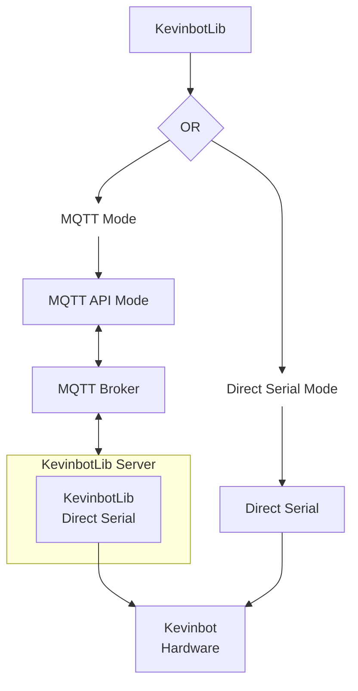

# Architecture

## Serial vs. MQTT

### Direct Serial

Pros

* Very low-latency
* More reliable
* Simpler

Cons

* Single client access
* Requires wired connection

### MQTT

Pros

* Multiple client access
* Networked
* Potentially easier to debug data

Cons

* Higher latency
* More complex/more to go wrong
* Requires MQTT Broker