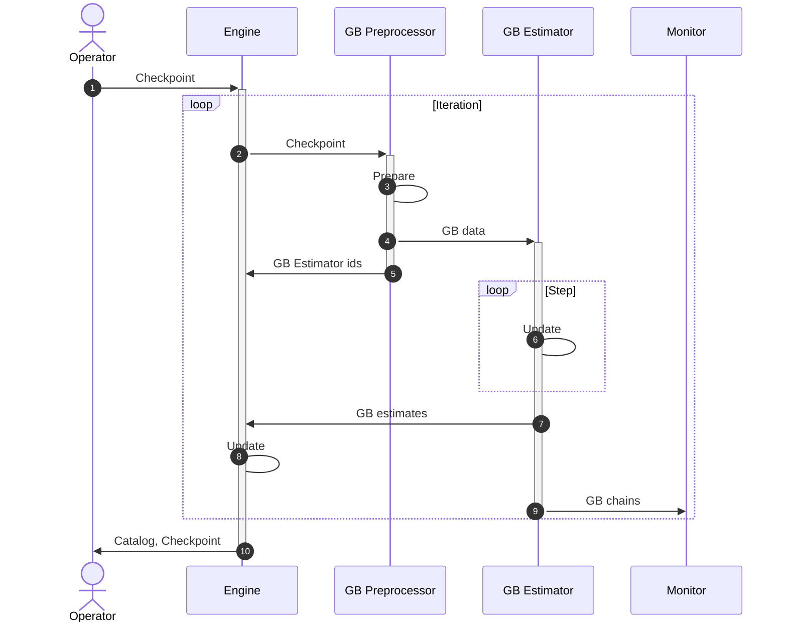
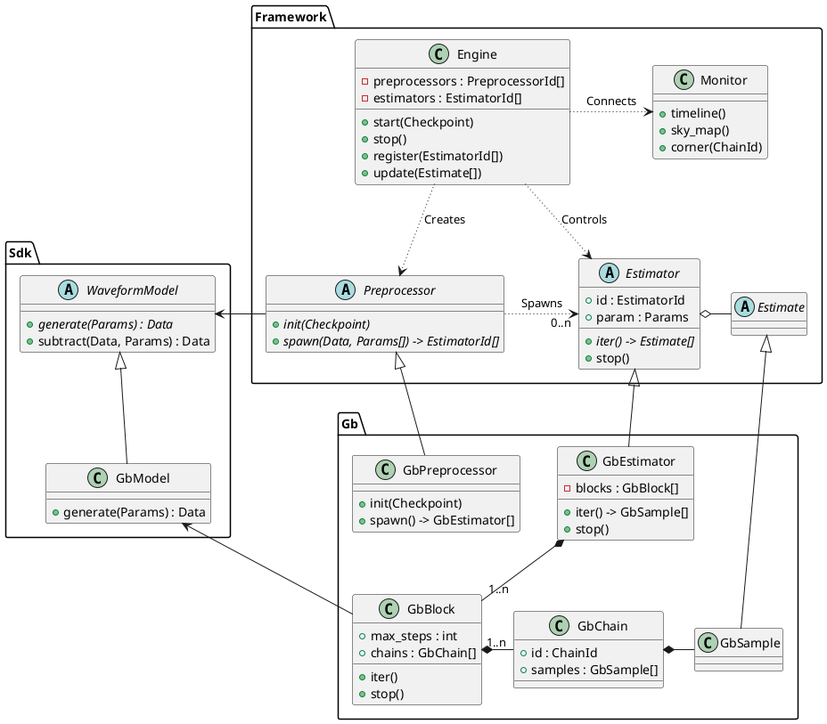

# Architecture

## Motivation for a Framework

GlobalFits generally consist of different types of MCMC blocks dedicated to specific types of gravitational events.
They could ideally be implemented by different persons, in different labs, probably inside containers, with different languages and technologies.

Moreover, the GlobalFits are so complex (hundreds of parallel branches) and long (weeks) that they cannot safely be run in standard computing center queues.
More specifically, HPC jobs must have a limited and known walltime in order to be triggered by the job schedulers.
Therefore, the job states must be save-able, and GlobalFits must be able to resume from a saved state.
This is commonly known as a Checkpoint/Resume ability.

In addition, the pipeline should support some level of interactivity, i.e. accept inputs from other (possibly human) actors during execution.
The simplest use case would be a graceful stopping of the GlobalFit when a scientific operator presses the Stop button, or a hard stopping by a computing center when allocated resources are exceeded.
More orchestrated use cases are envisioned, like feeding a GlobalFit with the outputs of another pipeline, like the Deep Analysis Alert Pipeline (DAAP).
Some of the use cases will be handled by the Pipeline Runner, but not all of them can be.

As of today, FR and US GlobalFits rely on implementations where all blocks are tightly coupled together, e.g. to communicate through MPI which is a very rigid solution.

The purpose of this proposal is to design some "GlobalFit Framework" which would allow developers to focus on their specific block(s), without impacting or being impacted by other blocks ongoing development.
To this end, we propose to move coupling outside of the code itself, as well-defined interfaces (which can themselves be designed in such a way that inter-block coupling is limited).

With respect to the System components, the Framework aims at minimizing integration efforts and leveraging science activities on labs side.
This means that using the Framework should be simpler than using the System components alone.

## Orchestration and Messaging

The Framework is made of orchestration and messaging systems.
It relies on a message Bus, and on an Engine to handle iterations and implement the overall strategy.
Blocks (e.g. a Noise, GB or MBHB sampler) are instantiated inside Modules which communicate with the Engine via messages.

Before we dive into the design, let us define a few terms in the context of the Framework:

* **Module:**
  An atomic execution unit.
* **Engine:**
  The GlobalFit scheduler and its control interface.
  This is a singleton Module (see below) which controls the start, iterations and ending of the GlobalFit.
* **Iteration:**
  The outer loop of the GlobalFit.
  Classical GlobalFits rely on Gibbs sampling where Gibbs blocks are updated independently inside one iteration and synchronize at the end of the iteration.
* **Step:**
  The loop inside a Block (see below), if any.
  This is generally an atomic update, like an MCMC step of a Gibbs sampler.
* **Model:**
  A type of component in the data, typically: noise, GB or MBHB.
* **Estimator:**
  The top-level algorithmic unit of a Model.
  This is a Module with an iteration sevice: each iteration returns a set of estimates for the Model.
  There are `0..n` Estimators per Model.
* **Block:**
  A lower level algorithmic unit of an Estimator, typically: one Gibbs block.
  There are `1..n` Blocks per Estimator.
  Having many Blocks and few Estimators enables more optimization opportunities than few Blocks within many Estimators, e.g. to parallelize likelihoods computation of a Model for several Blocks.

The Framework functionning is depicted in the sequence diagram below.

1. The Operator starts the GlobalFit with a Checkpoint, which can be handmade for initialization or can be the output or modified output of a previous run. The Checkpoints contains everything required to trigger an iteration.
2. For each iteration, according to the Models (e.g. GB, MBHB, EMRI) defined in the Checkpoint, the Engine creates the required Preprocessors -- only the GB Preprocessor is displayed here but others are symmetric.
3. The Preprocessor subtracts the contributions from other Models, e.g. MBHBs and EMRIs. Subtraction relies on the SDK, e.g. the waveform generators.
4. The Preprocessor evaluates the number of Estimators and Blocks to be instantiated for the current iteration. The Preprocessor spawns the Estimators and forwards the subtracted data as well as the parameters of its Model type, e.g. GB parameters.
5. The Preprocessors notify the Engine of the spawning, e.g. identifying the created Estimators so that the Engine can communicate with them.
6. The Blocks update, e.g. run a given amount of sampling steps for MCMC-based blocks.
7. The Blocks send their results to the Engine.
8. The engine updates the catalog and Checkpoint.
8. The Blocks send their state (e.g. MCMC chains) to the Monitor. The Monitor offers an interface to the User to access technical and scientific metrics, like iteration timing and corner plots, respectively.
10. The Engine returns both the GlobalFit results (typically the catalog and decimated chains) and the Checkpoint, which can be used to trigger a new GlobalFit run.

The pipeline stops either when a stopping criterion is reached (e.g. convergence metric, walltime, iteration count), or when a Stop message is sent by the Operator or System.

The number of Blocks or Estimators does not have to be constant: a Preprocessor evaluates the needs of its Model at the beginning of each iteration.

## Class Diagram

Below is a simplified and conceptual class diagram, i.e. depicted classes may be implemented differently, for example as applications, free functions, or type aliases.
Dotted arrows represent communications via the Pipeline Runner message Bus.
The package names help understanding the development life cycles and responsibitlities: while the Framework is maintained by the System team, the SDK is a common development effort and the models (GB in this example) are generally produced by dedicated labs.

