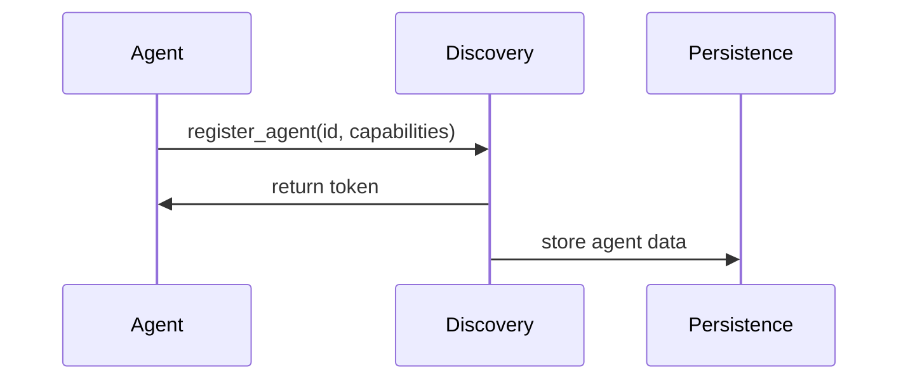
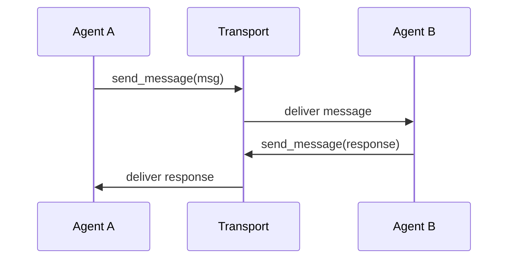

# Multi-Agent System (MAS) Architecture - MVP

## Overview
The Multi-Agent System (MAS) provides a foundation for agent-based communication and coordination. The MVP focuses on enabling basic agent registration, discovery, and message passing while maintaining system stability and message delivery.

## Core Components

### 1. Protocol Layer (`mas/protocol/`)
The protocol layer defines the core data models and types used throughout the system.

#### Key Components:
- **Message** (`message.py`)
  - Unique message ID
  - Timestamp
  - Sender and target IDs
  - Message type
  - Payload

- **Agent** (`agent.py`)
  - Agent ID and token
  - Status (ACTIVE/INACTIVE)
  - Capabilities
  - Last seen timestamp

- **Types** (`types.py`)
  - Message types (ERROR, COMMAND, RESPONSE, etc.)
  - Agent status types

### 2. Discovery Service (`mas/discovery/service.py`)
Handles agent registration and lookup within the system.

#### Responsibilities:
- Agent registration and deregistration
- Token generation and verification
- Agent status management
- Capability-based agent discovery
- Automatic cleanup of inactive agents

#### Key Operations:
```python
register_agent(agent_id: str, capabilities: Set[str]) -> str
find_agents(capabilities: Optional[Set[str]]) -> List[Agent]
verify_token(agent_id: str, token: str) -> bool
update_status(agent_id: str, status: AgentStatus) -> bool
```

### 3. Transport Service (`mas/transport/service.py`)
Manages message routing and delivery between agents.

#### Responsibilities:
- Message routing
- Subscription management
- Connection state management
- Basic error handling

#### Key Operations:
```python
send_message(message: Message) -> None
subscribe(subscriber_id: str, channel: str) -> None
unsubscribe(subscriber_id: str, channel: str) -> None
```

### 4. SDK Layer (`mas/sdk/`)
Provides the interface for agent implementation.

#### Responsibilities:
- Agent lifecycle management
- Message handling
- Connection management

## Message Flow

### 1. Agent Registration


### 2. Basic Message Flow


## Current Security Model
- Simple token-based authentication
- Basic agent status validation
- Channel-based message routing

## Persistence Layer
- Stores agent information
- Maintains agent status
- Tracks agent capabilities

## MVP Limitations
1. Simple channel-based routing
2. Basic token authentication
3. No message persistence
4. No guaranteed delivery
5. No message deduplication

## Extension Points
Future enhancements can be added through:
1. Message validation middleware
2. Enhanced routing logic
3. Security layer improvements
4. Message persistence
5. Delivery guarantees

## Configuration
The system uses simple runtime configuration for:
- Service timeouts
- Cleanup intervals
- Connection parameters

## Error Handling
- Basic error propagation
- Service state management
- Connection cleanup
- Simple retry logic

## Logging
- Basic debug logging
- Error tracking
- Service state changes
- Agent lifecycle events

## Development Guidelines
1. Keep components loosely coupled
2. Use async/await consistently
3. Handle errors gracefully
4. Log meaningful events
5. Maintain clear service boundaries

## Testing Strategy
1. Unit tests for core components
2. Integration tests for service interactions
3. Basic load testing
4. Error condition testing

This MVP architecture provides a foundation for:
- Basic agent communication
- Simple discovery mechanisms
- Stable message delivery
- Clear extension points

As the system evolves, complexity can be added in a controlled manner based on specific needs and use cases. 