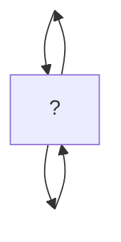

# Names

An API for exploring the essence of naming \


## Getting started

It's easy to start developing locally:

1. Install [uv](https://docs.astral.sh/uv/):

  ```console
  $ curl -LsSf https://astral.sh/uv/install.sh | sh
  ```
2. Clone this repository:

  ```console
  $ git clone git@github.com:eidorb/names.git
  $ cd names
  ```
3. Generate some names:

  ```console
  $ uv run -m names "seedy"
  gravity
  postage
  salary
  lobster
  garden
  ```
4. 🙇

uv will find, install and update a suitable Python interpreter and Python package dependencies as required. It's pretty fast.

Alternatively, you could activate a shell in the environment:

```console
$ uv sync
$ source .venv/bin/activate
```

And run commands as usual:

```console
(om-names)$ python -m names --help

 Usage: names.py [OPTIONS] [SEED]

 Generates a random sequence of names, seeded with SEED.
 Name things in your collection using the same SEED. Increase --offset as the
 collection grows. (You can name up to 1633 things.)

╭─ Arguments ──────────────────────────────────────────────────────────────────╮
│   seed      [SEED]  Use a fixed seed to ensure names are shuffled in the     │
│                     same order. It can be any value, even nothing. Just be   │
│                     sure to remember it.                                     │
╰──────────────────────────────────────────────────────────────────────────────╯
╭─ Options ────────────────────────────────────────────────────────────────────╮
│ --count                     INTEGER             Returns this many names.     │
│                                                 [default: 5]                 │
│ --offset                    INTEGER             Skip over this many names.   │
│                                                 [default: 0]                 │
│ --format                    [text|python|json]  [default: text]              │
│ --install-completion                            Install completion for the   │
│                                                 current shell.               │
│ --show-completion                               Show completion for the      │
│                                                 current shell, to copy it or │
│                                                 customize the installation.  │
│ --help                                          Show this message and exit.  │
╰──────────────────────────────────────────────────────────────────────────────╯
```


Deactivate when you're done:

```console
(om-names)$ deactivate
$
```


## Quick links

From the command line.

- Actions

  ```shell
  open "https://github.com/eidorb/${PWD##*/}/actions"
  ```
- Actions secrets

  ```shell
  open "https://github.com/eidorb/${PWD##*/}/settings/secrets/actions"
  ```


## Some command line poetry

```console
$ echo "write the most insightful and terse poem you can about the difficulties of " \
     "naming things using these words (be sure to include a valid http url link):\n" \
     "$(uv run -m names)" \
  | uvx llm -m grok-beta
In the realm of naming, a **spirit** soars,
A **toga** of words, a **concert** of thoughts.
A **period** of struggle, a **ranger** explores,
For the perfect name, a battle is fought.

[Explore the essence of naming](https://en.wikipedia.org/wiki/Naming)
```



> In the realm of naming, a **spirit** soars,\
> A **toga** of words, a **concert** of thoughts.\
> A **period** of struggle, a **ranger** explores,\
> For the perfect name, a battle is fought.
>
> [Explore the essence of naming](https://en.wikipedia.org/wiki/Naming)
